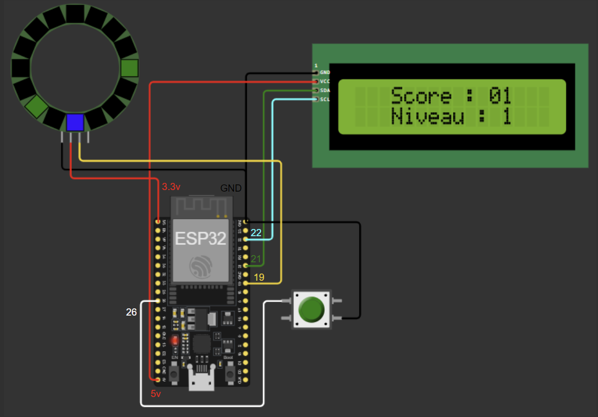

# Guide de Projet IoT

Ce guide vous expliquera étape par étape comment mettre en place un projet IoT utilisant les composants suivants :

- ESP32 Wroom 32
- Écran LCD 1602-A
- RGB LED Ring WS2812B 12-Bit 37mm
- Bouton poussoir

## Étapes d'Installation

### 1. Matériel Requis

Assurez-vous d'avoir les composants suivants :
- [ESP32 Wroom 32](https://www.espressif.com/sites/default/files/documentation/esp32-wroom-32_datasheet_en.pdf)
- [Écran LCD 1602-A](https://www.openhacks.com/uploadsproductos/eone-1602a1.pdf)
- [RGB LED Ring WS2812B 12-Bit 37mm](https://cdn.shopify.com/s/files/1/1509/1638/files/RGB_LED_Ring_37mm_Datenblatt_AZ-Delivery_Vertriebs_GmbH.pdf?v=1608471975)
- Bouton poussoir

### 2. Configuration du Logiciel

Téléchargez les bibliothèques nécessaires :
- [FastLED](https://github.com/FastLED/FastLED)
- [LiquidCrystal_I2C](https://github.com/johnrickman/LiquidCrystal_I2C)
- [WiFi](https://github.com/espressif/arduino-esp32/tree/master/libraries/WiFi)
- [WebServer](https://github.com/espressif/arduino-esp32/tree/master/libraries/WebServer)
- [WebSocketsServer](https://github.com/Links2004/arduinoWebSockets)

### 3. Connexion Matérielle

Connectez les composants selon le schéma suivant :

- ESP32 Wroom 32 :
- Écran LCD : Utilisez l'I2C (SDA et SCL) pour la connexion.
- RGB LED Ring : Connectez le pin de données à la broche définie dans le code (DATA_PIN).
- Bouton poussoir : Connectez-le à la broche définie dans le code (BUTTON_PIN).

### 4. Téléversement du Code

Téléversez le code fourni dans le microcontrôleur ESP32 Wroom 32.

## Explication du Code

Voici une explication étape par étape du code fourni :

### 1. Inclusions de Bibliothèques

Le code utilise plusieurs bibliothèques pour contrôler les composants matériels et établir une connexion Wi-Fi et un serveur Web.

### 2. Définition des Constantes

Les constantes telles que le nombre de LED, les broches de connexion et les paramètres Wi-Fi sont définies ici.

### 3. Configuration du Serveur Web

Le code met en place un serveur Web pour afficher le score et contrôler une LED.

### 4. Initialisation du Matériel

La fonction setup() initialise les composants matériels et établit la connexion Wi-Fi avec votre identifiant et mot de passe de connexion.

### 5. Boucle Principale

La fonction loop() gère le déroulement du jeu, la mise à jour de l'écran LCD et la vérification de l'état du bouton. Voici une explication détaillée de la boucle principale de jeu :

#### Boucle Principale de Jeu

La fonction `LoopDeJeu()` est responsable de la gestion du déroulement du jeu.

- Nous itérons à travers chaque LED du ring RGB et les mettons toutes en bleu.
- Ensuite, nous mettons à jour l'écran LCD avec le niveau actuel et le score.
- Nous attendons un certain nombre de cycles pour chaque LED (défini par `vitesse`).
- Pendant ce temps, nous vérifions si le bouton poussoir est enfoncé. Si c'est le cas, nous incrémentons le score, envoyons le nouveau score via WebSocket et vérifions si la LED à cette position est déjà activée. Si c'est le cas, le jeu se termine. Sinon, nous activons la LED, mettons à jour le nombre de LEDs valides et vérifions si toutes les LEDs ont été activées. Si c'est le cas, nous passons au niveau suivant en augmentant la vitesse et en réinitialisant les LEDs. Enfin, nous réinitialisons `isclicked` lorsque le bouton est relâché.
- Enfin, nous mettons à jour la couleur de la LED en fonction de son état (activée ou désactivée).

## Conclusion

Vous avez maintenant un projet IoT fonctionnel qui utilise un ESP32 Wroom 32, un écran LCD, un RGB LED Ring et un bouton poussoir. Amusez-vous bien !
